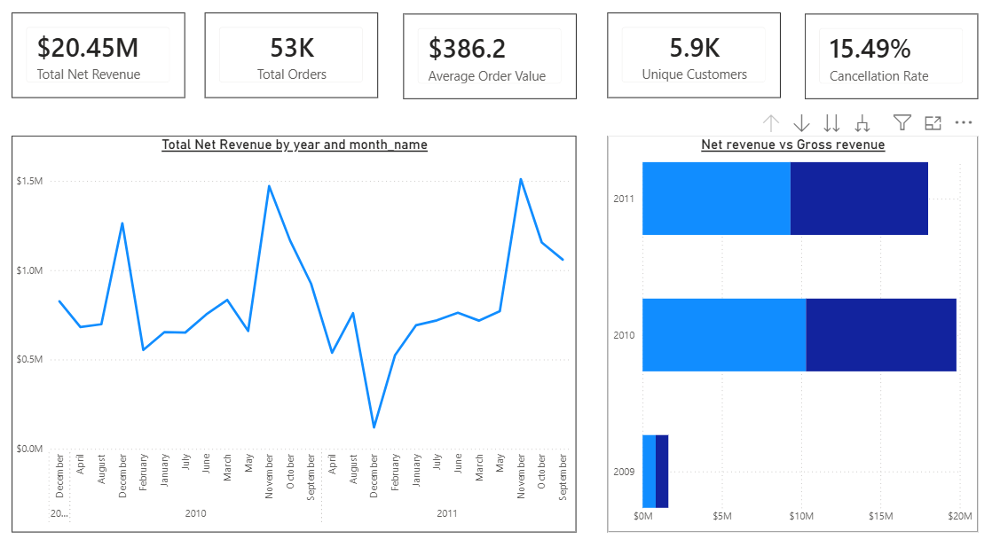
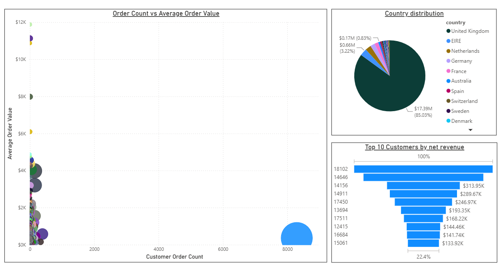
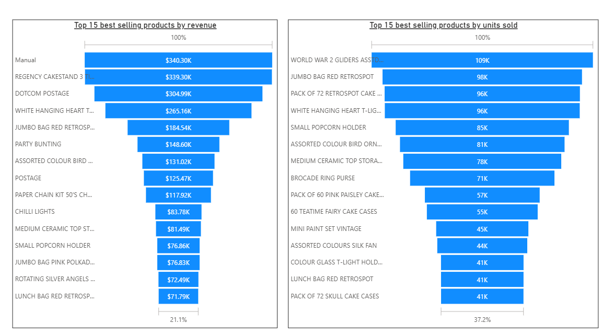

# RetailPro Analytics Platform

An end-to-end Analytics Engineering project that transforms 1M+ rows of raw, messy retail transaction data into a tested, documented star schema — built with **dbt Core**, **DuckDB**, and **Power BI**.


---

## What this project demonstrates

This isn't a tutorial walkthrough — it's a real transformation pipeline built on a genuinely messy public dataset (UCI's Online Retail II, ~1.05M invoice line items), with actual data quality problems discovered and resolved along the way.

| Skill | Where it shows up |
|---|---|
| **dbt Core** | Sources, staging models, dimensional models, macros, packages (`dbt_utils`) |
| **SQL transformation** | CTEs, window functions, surrogate key generation, conditional logic |
| **Data modeling** | Star schema design — grain decisions, degenerate dimensions, default-member pattern |
| **Data quality testing** | 25 automated tests: `not_null`, `unique`, `accepted_values`, `relationships` |
| **Data quality investigation** | Discovered and handled real issues: duplicate dimension keys, zero-value warehouse entries, multi-country customers |
| **Documentation** | Auto-generated dbt docs site with full column-level descriptions and lineage graph |
| **Git workflow** | Incremental, logically-scoped commits tracking the build from raw source to finished schema |
| **BI integration & DAX** | Three-page Power BI dashboard with a full measure layer (CALCULATE, DISTINCTCOUNT, DIVIDE) built from scratch, not out-of-the-box column aggregation |

---

## Architecture

```
CSV (Online Retail II, ~1.05M rows)
        │
        ▼
   DuckDB (read_csv, no import step)
        │
        ▼
   dbt source definition
        │
        ▼
   stg_online_retail  ── cleaning, type casting, quality flags
        │
        ├──▶ dim_customer
        ├──▶ dim_product
        ├──▶ dim_date
        │
        ▼
   fact_sales  ── joined on surrogate keys, net_revenue calculated
        │
        ▼
   Power BI Dashboard
```

**Why DuckDB, not Snowflake/Databricks/Fabric?** DuckDB was chosen deliberately for local development speed and zero infrastructure overhead — there's no cluster to provision or billing to manage, so the focus stays entirely on transformation logic and modeling decisions. The dbt modeling patterns used here (staging → dimensions → facts, testing, documentation) are directly transferable to any warehouse; only the connection profile would change. This project reflects hands-on dbt and DuckDB experience — not production experience with cloud warehouses, which is presented honestly rather than implied.

---

## Power BI Dashboard

The star schema exported from DuckDB feeds a three-page Power BI dashboard, connected via CSV import (see [connection note](#connecting-power-bi-to-duckdb) below) with a full DAX measure layer built on top — not just raw column aggregation.

### Executive Overview
KPI cards (net revenue, orders, average order value, unique customers, cancellation rate), a monthly revenue trend line, a revenue-by-country map, and a gross-vs-net revenue comparison that visually surfaces the impact of cancelled and zero-value transactions.



### Customer Analysis
Top customers ranked by net revenue, revenue distribution by country, and order frequency vs. average order value plotted per customer to surface high-value and high-frequency buyers at a glance.



### Product Analysis
Top products by revenue and by units sold — shown separately and deliberately, since the two rankings diverge (high-volume items are not always high-revenue items), plus total distinct products sold.



### Key DAX measures

```dax
Total Net Revenue = SUM(fact_sales[net_revenue])

Cancellation Rate = 
DIVIDE(
    CALCULATE(DISTINCTCOUNT(fact_sales[invoice_no]), fact_sales[is_cancelled] = TRUE),
    [Total Orders]
)

Customer Order Count = 
CALCULATE(
    DISTINCTCOUNT(fact_sales[invoice_no]),
    fact_sales[is_cancelled] = FALSE
)
```

### Connecting Power BI to DuckDB

There is currently no first-party, friction-free Power BI connector for local DuckDB files — the available ODBC driver and community Power Query connector both carry known setup issues. Rather than fight driver instability for a one-time static build, the finished star schema tables (`dim_customer`, `dim_product`, `dim_date`, `fact_sales`) are exported to CSV via a small DuckDB Python script (`export_to_csv.py`) and imported into Power BI directly — a common, defensible pattern for scheduled or batch-refreshed BI layers.

---

## Real data quality decisions (not hypothetical ones)

Every non-trivial modeling decision below was made after investigating actual data, not assumed upfront.

### 1. Cancelled orders — kept, not filtered
Invoices prefixed with `C` (e.g. `C489449`) represent cancellations, usually with negative quantities. Rather than discarding them in staging — which would silently make cancellation-rate analysis impossible later — they're preserved with an `is_cancelled` flag. The fact table's `net_revenue` column excludes them from revenue totals, while `line_total` keeps the raw figure available for anyone who needs it.

### 2. Missing customer IDs — kept, mapped to a default member
Guest/unidentified checkouts have a null `customer_id`. These are real transactions with real revenue, so excluding them would silently undercount sales. `dim_customer` includes a surrogate `'UNKNOWN'` row (the Kimball "default member" pattern), and every fact row with a missing customer maps to it via `coalesce()` instead of producing a null foreign key.

### 3. Duplicate dimension keys — caught by testing, not guessed
An early version of `dim_customer` deduplicated on `(customer_id, country)`. A `unique` test on `customer_key` failed with 13 duplicates. Investigation showed several customers had invoices from more than one country — the `distinct` was producing two rows per customer, which would have caused fact-table fan-out (double-counted sales) on every join. Fixed by deduplicating on `customer_id` alone and keeping `country` at the transaction grain in `fact_sales` instead of promoting it to the customer dimension.

### 4. "Wrongly coded" products — a genuine warehouse data issue
Investigating why one `stock_code` had 9 different descriptions revealed the code wasn't describing 9 product variants — it was being reused for warehouse annotations (`"wrongly coded-23343"`, `"found"`, `"missing"`) alongside a real product (`JUMBO BAG OWLS`). Cross-checking against `unit_price` showed the annotation rows all carried a price of `0.00`, confirming they weren't real sales. This led to an `is_zero_value` flag in staging, and `dim_product` now excludes zero-value rows before selecting the most frequent (canonical) description per stock code.

### 5. Referential integrity, verified at scale
`fact_sales` joins to all three dimensions via surrogate keys. Every join was tested with `relationships` tests confirming zero orphaned foreign keys, and row counts were explicitly compared (`1,048,575` staging rows in, `1,048,575` fact rows out) to rule out join fan-out before trusting any downstream metric.

---

## Data model

**Grain of `fact_sales`:** one row per invoice line item.

| Table | Type | Description |
|---|---|---|
| `stg_online_retail` | Staging (view) | Cleaned, typed, flagged raw transactions |
| `dim_customer` | Dimension | One row per customer, plus an `UNKNOWN` default member |
| `dim_product` | Dimension | One row per stock code, canonical description resolved by frequency |
| `dim_date` | Dimension | Calendar table, 2009–2026, generated via `dbt_utils.date_spine` |
| `fact_sales` | Fact | One row per invoice line, `net_revenue` and raw `line_total` both retained |

---

## Tech stack

- **dbt Core 1.11** — transformation, testing, documentation
- **DuckDB** (via `dbt-duckdb` adapter) — local analytical database, reads CSV directly
- **dbt_utils** — surrogate key generation, date spine
- **Power BI** — three-page dashboard with a custom DAX measure layer
- **Python (duckdb library)** — exports finished star schema to CSV for Power BI import
- **Git / GitHub** — version control

---

## Running this project locally

```bash
# Clone and enter the project
git clone https://github.com/rajeshwaraa/retailpro_analytics_platform.git
cd retailpro_analytics_platform/retail_sales_analytics

# Set up Python environment
python -m venv .venv
.venv\Scripts\Activate.ps1        # Windows PowerShell
pip install dbt-core dbt-duckdb

# Install dbt packages
dbt deps

# Download the dataset (not included in repo — see note below)
# Place online_retail_II.csv in the data/ folder

# Verify the connection
dbt debug

# Build everything
dbt run

# Run all tests
dbt test

# Generate and view documentation
dbt docs generate
dbt docs serve
```

**Dataset note:** the raw CSV is not committed to this repo (~45MB, excluded via `.gitignore`). Download it from [Kaggle: Online Retail II (UCI)](https://www.kaggle.com/datasets/mashlyn/online-retail-ii-uci) and place it at `data/online_retail_II.csv`.

---

## Test coverage

25 automated data tests across the full pipeline:

| Layer | Tests | Result |
|---|---|---|
| `stg_online_retail` | 10 | ✅ All passing |
| `dim_customer` | 4 | ✅ All passing |
| `dim_product` | 4 | ✅ All passing |
| `dim_date` | 4 | ✅ All passing |
| `fact_sales` | 7 (including 3 referential integrity checks) | ✅ All passing |

---

## About this project

Built as a hands-on portfolio project to develop and demonstrate Analytics Engineering skills — bridging existing Power BI and business intelligence experience with dbt, SQL transformation, and dimensional modeling. Every design decision documented above reflects an actual investigation of the data, not an assumed best practice applied blindly.

**Author:** Rajeshwaran R
**Background:** Power BI / BI Analytics (11+ years) → Analytics Engineering
**Connect:** [https://www.linkedin.com/in/rajeshwaran-analytics/] · [GitHub](https://github.com/rajeshwaraa)